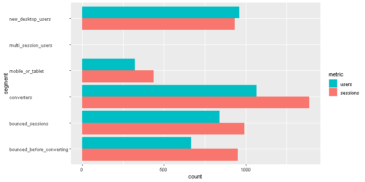

`ganalytics` provides functions that makes it easy to define filters and segments using natural R language comparison and logical operators. This example demonstrates how to define dynamic segments using functions from the `ganalytics` package and using those segments with the `googleAnalyticsR` package. The current development version of `googleAnalyticsR` supports segments and filters defined with `ganalytics`.

## Setup/Config

Note that this example requires the current development versions of the `googleAnalyticsR` (>=0.5.0.9000) and `ganalytics` (>=0.10.4.9000) R packages available on GitHub. To install these, run the following code in R:

```r
devtools::install_github("MarkEdmondson1234/googleAnalyticsR")
devtools::install_github("jdeboer/ganalytics")
```

Once installed, load these packages. Please refer to the `googleAnalyticsR` package documentation on configuration steps you may need to complete in order to use the Google Analytics APIs.


```r
library(googleAnalyticsR)
```

```
## 2018-12-09 09:40:38> No environment argument found, looked in GA_AUTH_FILE
```

```r
library(ganalytics)
library(dplyr)
```

```
## 
## Attaching package: 'dplyr'
```

```
## The following objects are masked from 'package:ganalytics':
## 
##     mutate, rename
```

```
## The following objects are masked from 'package:stats':
## 
##     filter, lag
```

```
## The following objects are masked from 'package:base':
## 
##     intersect, setdiff, setequal, union
```

```r
library(tidyr)
library(ggplot2)
library(purrr)
```

```
## 
## Attaching package: 'purrr'
```

```
## The following object is masked from 'package:ganalytics':
## 
##     flatten
```

```r
library(knitr)

ga_auth(file.path("~", "ga.oauth"))
```

```
## Token cache file: ~/ga.oauth
```

```r
view_id <- "117987738"
start_date <- "2018-05-01"
end_date <- "2018-06-30"
```

## Pull the Data

In this example, we'll define a list of six segments:
* Bounced sessions: Sessions where the bounces metric is not zero.
* Mobile or tablet sessions: Sessions by mobile and tablet users.
* Converters: Users who performed any type of conversion during the defined date range.
* Multi-session users: Users who have visited more than once during the defined date range.
* New desktop users: Sessions by new visitors using a desktop device.
* Bounced before converting = Users who bounced in one session before converting later.

The above list of dynamic segments is defined using `ganalytics` expressions as follows:


```r
bounces <- Expr(~bounces != 0)
conversions <- Expr(~goalCompletionsAll > 0) | Expr(~transactions > 0)
mobile_or_tablet <- Expr(~deviceCategory %in% c("mobile", "tablet"))
multi_session_users <- Include(PerUser(Expr(~sessions > 1)), scope = "users")
new_desktop_users <- Expr(~deviceCategory == "desktop") & Expr(~userType == "new")

my_segment_list <- list(
  bounced_sessions = PerSession(bounces),
  mobile_or_tablet = mobile_or_tablet,
  converters = PerUser(conversions),
  multi_session_users = multi_session_users,
  new_desktop_users = new_desktop_users,
  bounced_before_converting = Sequence(bounces, conversions, scope = "users")
)
```

Because the Google Analytics Reporting API can only be used to query 4 segments at a time, we need to break our list segments into chunks.


```r
segment_chunks <- split(my_segment_list, (seq_along(my_segment_list) - 1L) %/% 4L)
```

We can now use `googleAnalyticsR` to query each chunk of segments and bind the results into a single `data.frame`. For each segment, we will request a count of users and sessions.


```r
results <- map_df(segment_chunks, function(chunk) {
  google_analytics(
    viewId = view_id,
    date_range = c(start_date, end_date),
    metrics = c("users", "sessions"),
    dimensions = c("segment"),
    segments = Segments(chunk)
  )
})
```


```r
kable(results)
```


|segment                   | users| sessions|
|:-------------------------|-----:|--------:|
|bounced_sessions          |   839|      991|
|converters                |  1066|     1388|
|mobile_or_tablet          |   322|      437|
|multi_session_users       |     0|        0|
|bounced_before_converting |   667|      950|
|new_desktop_users         |   962|      933|

## Data Munging and Visualization

We will compare users and sessions for each segment using a horizontal column chart. To do this we need to transform the results table into long format in which the count of users and sessions for each segment are on separate rows.


```r
results_long <- results %>%
  gather(metric, count, users, sessions)
```


```r
kable(results_long)
```


|segment                   |metric   | count|
|:-------------------------|:--------|-----:|
|bounced_sessions          |users    |   839|
|converters                |users    |  1066|
|mobile_or_tablet          |users    |   322|
|multi_session_users       |users    |     0|
|bounced_before_converting |users    |   667|
|new_desktop_users         |users    |   962|
|bounced_sessions          |sessions |   991|
|converters                |sessions |  1388|
|mobile_or_tablet          |sessions |   437|
|multi_session_users       |sessions |     0|
|bounced_before_converting |sessions |   950|
|new_desktop_users         |sessions |   933|


```r
ggplot(results_long) +
  aes(segment, count, fill = metric) +
  geom_col(position = "dodge") +
  guides(fill = guide_legend(reverse = TRUE)) +
  coord_flip() +
  theme(axis.text.y.left = element_text(hjust = 0))
```



